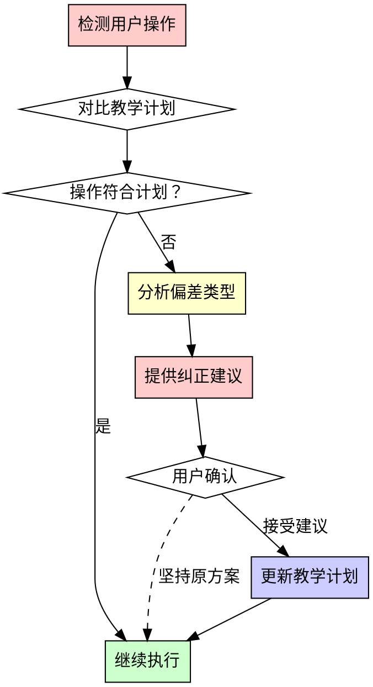

# 教学计划同步技能 (Teaching Plan Synchronization)

## 概述

本技能用于确保用户按照教学计划的正确步骤进行实训开发。当检测到用户操作与教学计划不符时，及时提供纠正建议并更新教学计划文档。

**核心原则：** 教学计划是实训的路线图，任何偏离都可能导致学习效果下降或技术债务累积。

## 何时使用

**必须使用时：**
- 用户开始新的开发任务
- 用户执行代码变更前
- 用户报告问题或错误时
- 用户请求创建新功能或文件
- 用户执行 Git 操作（commit/branch/merge）

**检查触发点：**
- 创建新文件/目录
- 修改配置文件
- 安装依赖
- 数据库操作
- API 开发
- 部署操作

## 教学计划结构

```
教学计划.md
├── Day 1: 项目启动与工程化初探
│   ├── 步骤1: 项目初始化（Python虚拟环境、依赖安装）
│   ├── 步骤2: Git配置（分支创建、.gitignore）
│   ├── 步骤3: 云端环境搭建（Supabase）
│   └── 步骤4: 数据库连接测试
├── Day 2: RAG向量库与数据融合
│   ├── 步骤1: 环境准备（LangChain、ChromaDB）
│   ├── 步骤2: 向量库构建
│   └── 步骤3: 数据融合测试
├── Day 3: Neo4j知识图谱与Text-to-Cypher
│   ├── 步骤1: Neo4j环境准备
│   ├── 步骤2: 图建模与数据导入
│   └── 步骤3: Text-to-Cypher实现
├── Day 4: FastAPI基础与业务API
│   ├── 步骤1: FastAPI项目搭建
│   ├── 步骤2: 业务表设计与DAO层
│   └── 步骤3: API端点开发
├── Day 5: LangGraph状态管理与持久化
│   ├── 步骤1: LangGraph环境准备
│   ├── 步骤2: 基础状态机实现
│   └── 步骤3: PostgresSaver持久化
├── Day 6: 多智能体编排与RAG智能体
│   ├── 步骤1: 编排器实现
│   ├── 步骤2: RAG智能体开发
│   └── 步骤3: 路由逻辑测试
├── Day 7: 工具智能体与MCP协议
│   ├── 步骤1: MCP Server实现
│   ├── 步骤2: 工具智能体开发
│   └── 步骤3: 导航功能集成
├── Day 8: 记忆智能体与全链路整合
│   ├── 步骤1: 记忆智能体实现
│   ├── 步骤2: 全链路测试
│   └── 步骤3: 端到端验证
├── Day 9: Next.js前端与SSE
│   ├── 步骤1: Next.js项目搭建
│   ├── 步骤2: 聊天界面开发
│   └── 步骤3: SSE流式通信
└── Day 10: CI/CD与Vercel部署
    ├── 步骤1: GitHub Actions配置
    ├── 步骤2: Vercel部署
    └── 步骤3: 生产环境验证
```

## 偏差检测流程



## 常见偏差类型

### 1. 顺序偏差
**示例：** Day 1 还未完成环境配置，就开始编写业务代码

**纠正策略：**
```
⚠️ 检测到顺序偏差

当前操作：编写 API 业务代码
教学计划：Day 1 步骤4 - 数据库连接测试

建议：
1. 先完成数据库连接测试 (python db/connect.py)
2. 确保 .env 配置正确
3. 然后再开始 Day 2 的内容

是否暂停当前操作，返回完成前置步骤？[是/否]
```

### 2. 工具偏差
**示例：** 使用 pip 而不是 uv，使用 venv 而不是 .venv

**纠正策略：**
```
⚠️ 检测到工具使用偏差

当前操作：python -m venv venv
教学计划：uv venv (创建 .venv)

建议：
1. 删除旧环境：rm -rf venv
2. 使用 uv 创建：uv venv
3. 激活：source .venv/bin/activate

原因：
- uv 速度比 pip 快 10-100 倍
- .venv 是隐藏目录，更规范
- 与教学文档保持一致

是否采用正确方式？[是/否]
```

### 3. 配置偏差
**示例：** 使用本地 PostgreSQL 而不是 Supabase

**纠正策略：**
```
⚠️ 检测到配置偏差

当前操作：配置本地 PostgreSQL
教学计划：使用 Supabase 云数据库

建议：
1. 注册 Supabase 账号
2. 创建项目获取连接信息
3. 更新 .env 文件

.env 示例：
SUPABASE_URL="https://your-project.supabase.co"
SUPABASE_KEY="your-anon-key"

原因：
- 教学项目要求云端部署
- Supabase 提供免费云实例
- 与 Vercel 部署兼容

是否切换到 Supabase？[是/否]
```

### 4. 结构偏差
**示例：** 将知识点文档放在根目录而不是 docs/

**纠正策略：**
```
⚠️ 检测到目录结构偏差

当前操作：在根目录创建 环境配置.md
教学计划：docs/环境配置指南.md

建议：
1. 移动文件到 docs/ 目录
2. 更新 README.md 中的链接
3. 遵循项目文档规范

项目结构规范：
docs/
├── 环境配置指南.md
├── Git-GitHub使用指南.md
└── ...

原因：
- 教学方案要求统一存放
- 便于学生查找学习资料
- 与项目规范一致

是否移动文件？[是/否]
```

## 检测规则

### Day 1 检查清单
```yaml
前置条件:
  - Python 版本 >= 3.9
  - Git 已安装
  
步骤检查:
  步骤1_项目初始化:
    - 检查: 虚拟环境创建方式 (应为 uv venv)
    - 检查: 虚拟环境目录名 (应为 .venv)
    - 检查: 依赖安装命令 (应为 uv pip install 或 pip install -i 清华镜像)
    - 检查: requirements.txt 存在
    
  步骤2_Git配置:
    - 检查: 分支结构 (main/dev/feature/day1)
    - 检查: .gitignore 内容 (包含 .venv/, .env, __pycache__/)
    - 检查: Commit 格式 (Conventional Commits)
    
  步骤3_云端环境:
    - 检查: .env 文件存在
    - 检查: SUPABASE_URL 配置
    - 检查: SUPABASE_KEY 配置
    
  步骤4_数据库测试:
    - 检查: db/connect.py 可运行
    - 检查: 连接测试通过
```

### Day 2-10 检查清单
每个 Day 都有类似的检查点，检测：
- 前置步骤是否完成
- 依赖是否正确安装
- 文件是否在正确位置
- 代码是否符合规范

## 执行流程

### 当用户开始操作时：

1. **识别当前阶段**
   ```python
   def detect_current_stage():
       # 检查 .env 是否存在
       # 检查数据库连接代码
       # 检查 Git 分支
       # 返回当前应处于的 Day 和步骤
   ```

2. **分析用户意图**
   ```python
   def analyze_user_intent(user_action):
       # 解析用户操作
       # 识别操作类型（创建/修改/删除）
       # 识别操作对象（文件/配置/依赖）
   ```

3. **对比教学计划**
   ```python
   def compare_with_plan(current_stage, user_intent):
       # 检查是否符合当前步骤
       # 检查是否跳过了前置步骤
       # 检查是否使用了正确工具
       # 返回偏差类型和建议
   ```

4. **生成反馈**
   ```python
   def generate_feedback(deviation_type, suggestion):
       # 格式化提示信息
       # 提供纠正建议
       # 询问用户确认
   ```

## 响应模板

### 模板1：顺序警告
```markdown
## ⚠️ 步骤顺序提醒

**当前操作：** {user_action}
**教学计划：** Day {day} 步骤 {step} - {step_name}

**问题：** 您似乎正在执行 Day {current_day} 的内容，但 Day {required_day} 的前置步骤尚未完成。

**前置依赖：**
- [ ] {prerequisite_1}
- [ ] {prerequisite_2}
- [ ] {prerequisite_3}

**建议：**
1. 先完成上述前置步骤
2. 验证每个步骤的输出
3. 然后再继续当前操作

**是否暂停当前操作，先完成前置步骤？**
[继续当前操作] [先完成前置步骤]
```

### 模板2：工具纠正
```markdown
## 🔧 工具使用建议

**当前操作：** {current_command}
**推荐方式：** {recommended_command}

**差异说明：**
{explanation}

**正确做法：**
```bash
{correct_commands}
```

**原因：**
- {reason_1}
- {reason_2}
- {reason_3}

**是否采用推荐方式？**
[是，使用推荐方式] [否，坚持当前方式]
```

### 模板3：文档更新提醒
```markdown
## 📝 教学计划更新

**检测到：** 您采用了与教学计划不同的实现方式。

**您的做法：**
{user_approach}

**教学计划：**
{plan_approach}

**建议更新教学计划以反映最佳实践：**
```diff
- {old_content}
+ {new_content}
```

**更新原因：**
{update_reason}

**是否更新教学计划？**
[更新教学计划] [保持原样]
```

## 与教学大纲的关联

本技能直接服务于 [教学大纲.md] 中定义的：
- 课程目标：工程化规范落地
- 核心交付：可部署的多智能体系统
- 教学理念：从"技术使用"到"工程落地"

通过本技能确保每个学员都能：
1. 按照正确顺序掌握技术栈
2. 使用企业级工具和最佳实践
3. 形成规范的工程化思维
